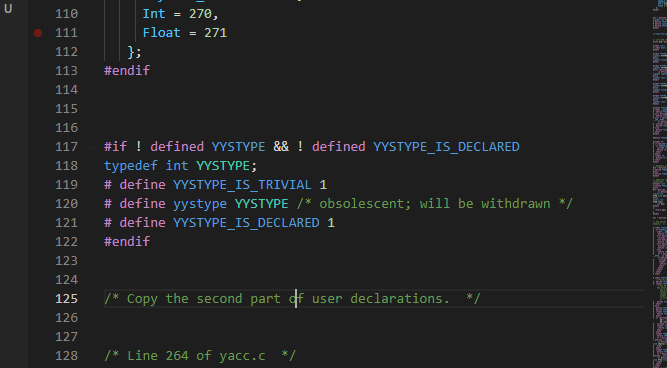

# Всем привет! 👋👋
<h1 align="center">
    Не знаю, кто вы и как нашли этот профиль... Возможно, найдёте что-то интересное
</h1>
<h2> На момент создания этого readme мечусь из стороны в сторону. Сейчас добрались руки до заброшенного проекта. Получается, что полирую его, делаю из него конфетку. </h2> 

<h3 align="center">P.S.. Скрин рандомный</h3> 

# Немного статистики

Пока из наиболее интересного:
- Проект, скрывающий под собой [игру](https://github.com/vlad20112/thirdProject) на движке [FunGEn](https://github.com/haskell-game/fungen) (страшное дело, но почему бы и нет);
- Наброски для [интерпретатора](https://github.com/vlad20112/InterpretatorFunc) функционального языка(требуется провести жутчайший рефакторинг и много чего реализовать)
